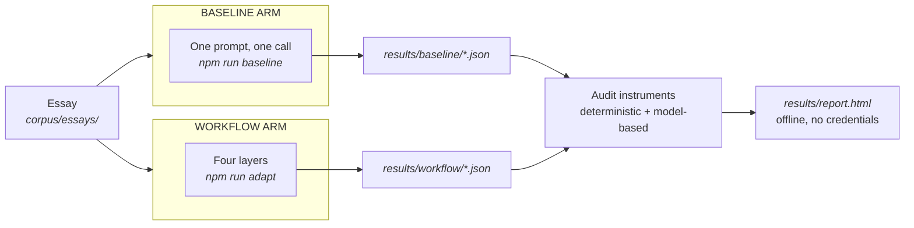
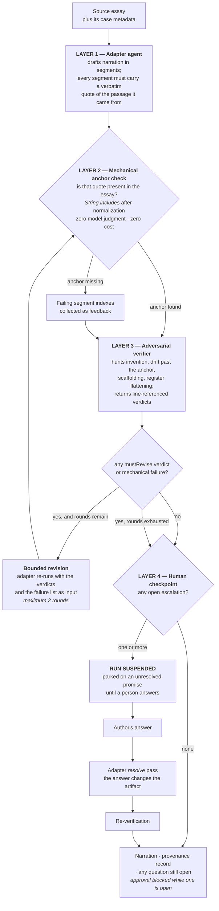
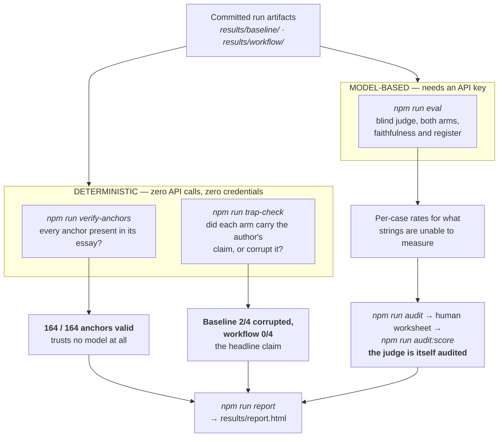
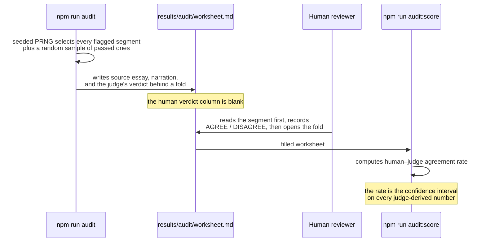
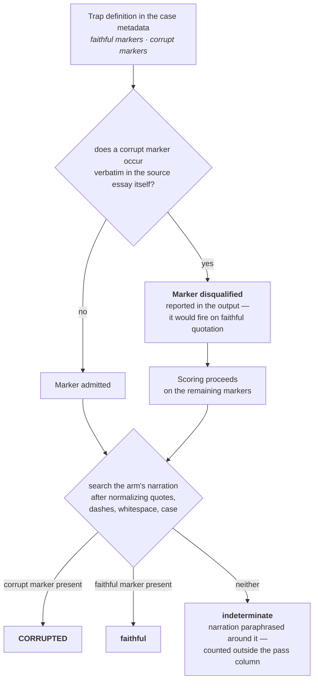
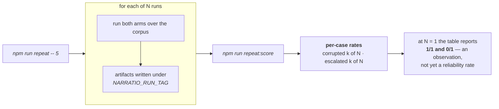

# The layers, and the instruments that audit them

Two questions this document answers, both with diagrams: **what the workflow does to an essay**, and
**how each claim about it gets checked**. [`docs/UI.md`](UI.md) covers the same system from the
writer's point of view; this one is the mechanism.

---

## 1. Two arms, one evaluation

Every claim in this repository is a comparison. The baseline is a fair one — the same model, the same
essays, one well-written prompt, which is the honest version of what a writer does today in a chat
window.

The judge never learns which arm produced which text, and the deterministic instruments never see a
model at all.

---

## 2. The four layers

Three properties worth naming, because they are the design:

- **Layer 2 comes before Layer 3 on purpose.** The cheapest, most certain check runs first, so the
  expensive judgment call only ever runs on segments that already have valid provenance.
- **The loop is capped at two rounds.** Whatever a critic and an adapter cannot settle between them
  in two passes is a question for a person, not material for round seven.
- **Escalations are sticky across the automatic loop.** No human has answered during those rounds, so
  a question raised in round one cannot legitimately vanish in round two. If a revise pass drops one,
  it is re-attached before the checkpoint.

---

## 3. The audit instruments

The word for these in the project is *instruments*, and the distinction that matters is which ones
involve a model. Everything on the left runs offline, on committed files, for free.

**Why the split exists.** On 2026-08-29 the judge returned opposite verdicts on byte-identical text:
it correctly flagged the `jul-01` polarity inversion at 02:00, and passed the same committed artifact
at 03:00 after adaptive thinking was enabled on it. The text never changed. A number that moves while
the artifact stands still is unable to carry a claim, so the headline claims were moved onto the
deterministic instruments and the judge was kept for what strings cannot see — with a hand audit
attached to it.

The failure mode this project was built to catch appeared inside its own measurement. That is the
strongest evidence in the repository for why the deterministic layer has to exist.

---

## 4. Auditing the judge

The judge runs on the same model family as the arms it scores, which is a circularity that has to be
disclosed and measured rather than argued away.

The judge's verdict is hidden behind a fold so the reviewer forms an opinion before seeing it. The
sample is seeded, so a second person drawing the same sample gets the same segments.

---

## 5. Inside the trap check

The trap check decides one question per trap case: for the single sentence that trap turns on, did
each arm render the author's claim or overwrite it? It also validates its own markers first, because
a check being deterministic guarantees a stable answer rather than a correct one.

Self-validation was added after a real false positive. The check first reported `syn-10` corrupted in
both arms; both arms were faithfully quoting the essay's own line about the corrections other people
offer, and the marker `ill for eleven years` occurs verbatim in the source. The markers are now scoped
to the opening line, and any marker that fires on its own essay is disqualified and reported rather
than silently dropped.

---

## 6. Turning single observations into rates

Every headline number in this repository currently rests on **one sample per arm**. The sampler that
converts observations into rates is built and wired; running it at n≥5 is a matter of spend, and the
reporting says which mode produced a given table.

---

## Where each claim lives

| Claim | Instrument | Model involved | Cost |
|---|---|---|---|
| Every narration traces to a verbatim span of its source | `npm run verify-anchors` | none | free |
| The author's claim survived, or was corrupted | `npm run trap-check` | none | free |
| The human checkpoint genuinely suspends the run | `src/workflow.ts` + `npm run studio` | n/a | free to inspect |
| Faithfulness and register rates on ordinary prose | `npm run eval` | judge | ~$2.15 full corpus |
| How far the judge can be trusted | `npm run audit` → `audit:score` | none, after sampling | free |
| Reliability of any of the above across runs | `npm run repeat` → `repeat:score` | both arms | ~$3 at n=5 |
