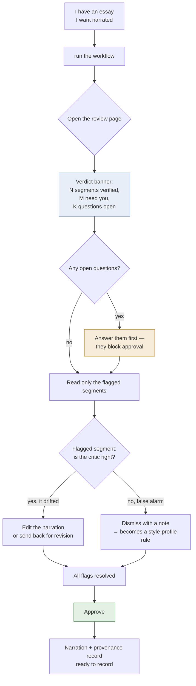
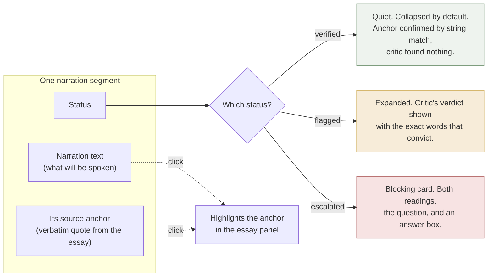
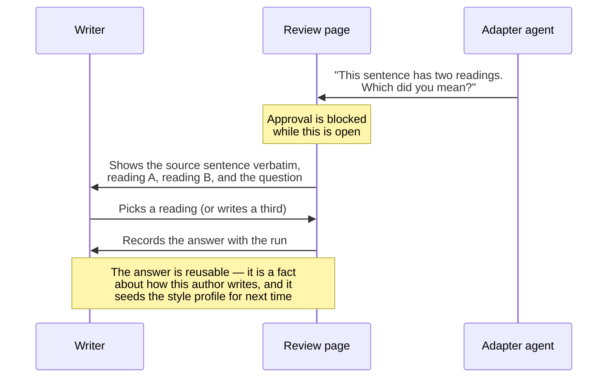
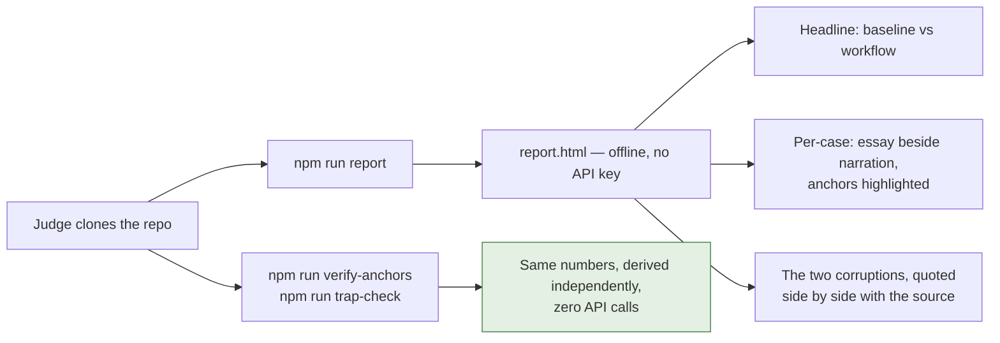
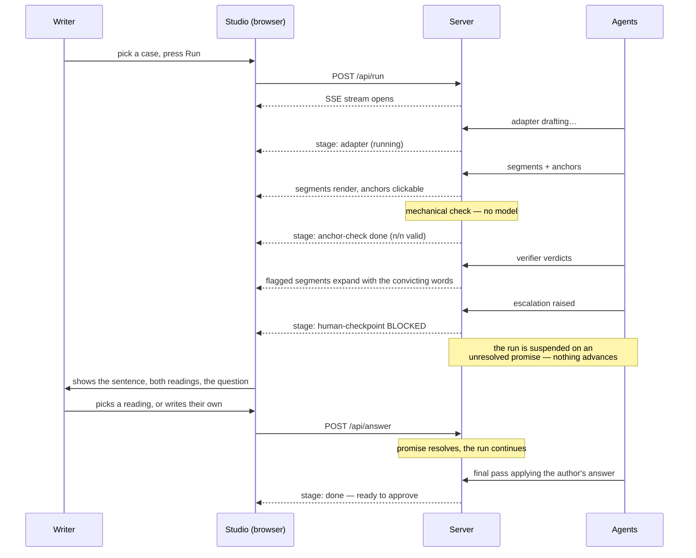

# Review UI — design

The workflow's output is a draft plus a list of decisions a human must make. Until now that arrived
as JSON, which is fine for a machine and hostile to the person whose name goes on the text. This
document specifies the review surface: what the writer sees, in what order, and why.

**Two surfaces, because reviewing a finished run and watching one happen are different jobs:**

| | `npm run report` | `npm run studio` |
|---|---|---|
| What it is | A single self-contained HTML file built from committed results | A local server that runs the real workflow live |
| Needs a key | No — opens over `file://`, works offline | Yes — it executes the workflow |
| Good for | Reviewing a finished run; a judge auditing claims for free | Watching stages execute, and answering the agent when it stops |
| The checkpoint | Shown as a record of what was asked | **Genuinely blocks** — the run suspends until you answer |

The studio exists because a checkpoint that never suspends anything is a claim the architecture
fails to enforce. In `studio`, `askHuman` parks the run on an unresolved promise; nothing advances
until a person posts an answer, and that answer is fed back into a final adapter pass so it changes
the artifact. Rules 4 and 5 ask for human approval *before* the consequential action, and control
flow is the only honest way to demonstrate it.

---

## Who is using this, and in what state of mind

The writer has already written the essay. They are now deciding whether to put their name on a
machine's rendering of it. Their scarce resource is **attention**, and the thing they most want to
avoid is re-reading their own essay line by line against the draft.

So the interface has one job: **direct attention to the places that need it, and earn trust for the
places that don't.**

## The inversion the UI exists to deliver

| Without the tool | With the tool |
|---|---|
| Read 100% of the narration against 100% of the essay | Read the flagged segments; trust the verified ones |
| No idea which sentence to doubt | Every doubt is located and quoted |
| Ambiguity already resolved, invisibly | Ambiguity presented as a question you answer |

## Main flow — the writer's path



## What the writer sees per segment



## The escalation moment — the product's centre



## Reviewer's path for a judge with no credentials



---

## Layout

Two panes, source on the left and narration on the right, because that is the comparison the writer
is actually making. A status banner sits above both.

```
┌──────────────────────────────────────────────────────────────────────┐
│  jul-01 · O inefável            18 verified · 2 flagged · 1 question  │
│  [ Overview ]  [ jul-01 ]  [ syn-09 ]  [ syn-10 ]  [ syn-11 ]  …     │
├────────────────────────────────┬─────────────────────────────────────┤
│  SOURCE ESSAY                  │  NARRATION                          │
│                                │                                     │
│  existem sentimentos que       │  ① Existem sentimentos que ainda    │
│  ainda não tem registro na     │     não têm registro na linguagem.  │
│  linguagem e ▓nomeá-los não    │     ✓ verified                      │
│  o torna mais "inefável"▓,,    │                                     │
│  aquilo que escapa à           │  ⚠ QUESTION — blocks approval       │
│  expressão verbal…             │     "nomeá-los não o torna mais     │
│                                │      inefável" has two readings:    │
│  ▓ highlighted = the anchor    │      A) naming fails to dissolve…   │
│    of the selected segment     │      B) lacking a name fails to…    │
│                                │     [ A ] [ B ] [ neither: ____ ]   │
└────────────────────────────────┴─────────────────────────────────────┘
```

**Design rules, each earning its place:**

1. **Verified segments collapse.** They are the majority and the whole point is that you skip them.
   Showing them at full weight would recreate the read-everything problem in a nicer font.
2. **Clicking a segment highlights its anchor in the essay.** This is the provenance claim made
   tangible: the writer sees the exact words their narration came from.
3. **Escalations are cards, not annotations, and they sit above the fold.** They block approval, so
   they cannot be styled as advice.
4. **The critic quotes the convicting words.** A verdict without evidence is an opinion.
5. **Colour carries meaning and never carries it alone.** Every state has a text label, so the page
   works in greyscale and for colour-blind readers.
6. **Dismissing a false alarm asks for one line of reasoning.** That line is the seed of a style
   rule, which is how the system learns this author.

## Live run — what the studio shows



## Scope for the hackathon build

In: the static report (overview, per-case two-pane review, anchor highlighting, inline critic
verdicts, escalation cards, baseline-vs-workflow diff on trap sentences) and the live studio
(streamed stages, clickable anchors as they arrive, a blocking checkpoint that resumes on an
answer, running cost).

Out: editing narration in the browser, multi-user anything, and authentication — the studio binds
to localhost and is a single-operator tool. Studio runs are written to
`results/workflow/<id>.studio.json` so an interactive session never overwrites the committed
batch artifacts the evaluation depends on.
